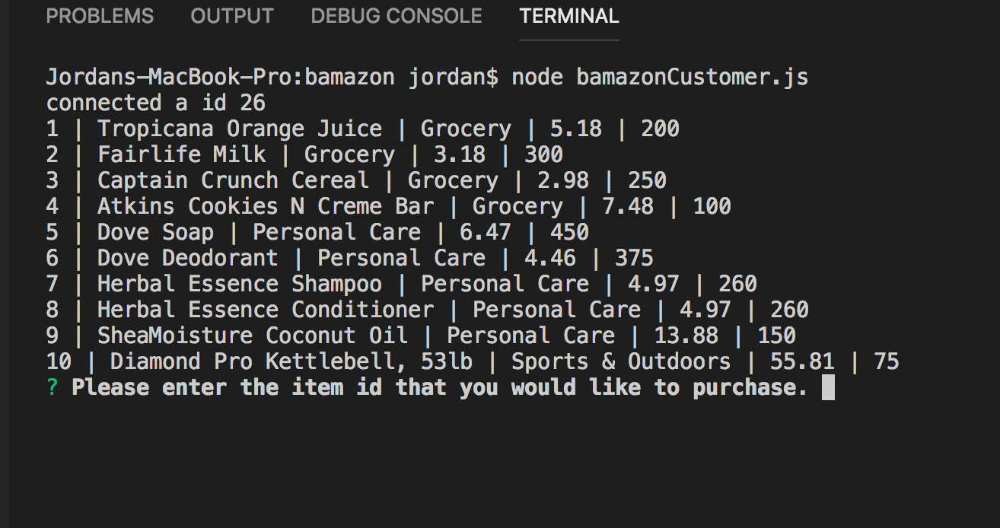
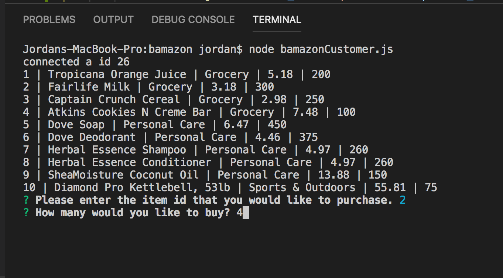
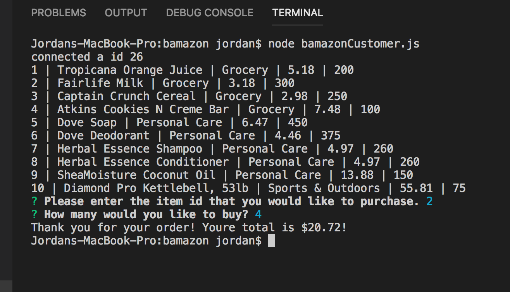
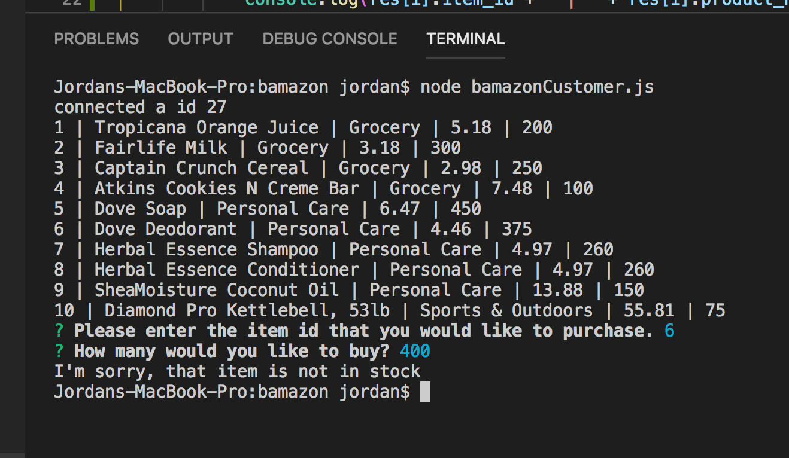

# bamazon

## What is Bamazon?
Bamazon is an online shopping experience that the user a list of the products offered. 

## How to use it
Once the user has read the list, they are asked to input the item id of the item that they would like to purchase. 

Once they have answered that question, they are then asked how many of that item would they like to buy.

 The database is then checked to see if bamazon has that quantity in stock. If so, the customer is thanked for their purchase and told their total.

 
 
If that quantity is not in stock, the user is informed that we do no have it in stock.

